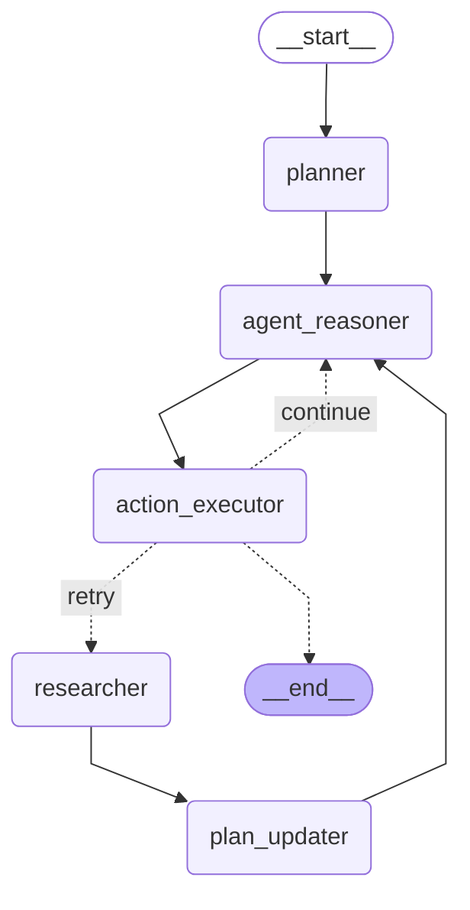

```mermaid
---
config:
  flowchart:
    curve: linear
---
graph TD;
	__start__([<p>__start__</p>]):::first
	planner(planner)
	agent_reasoner(agent_reasoner)
	action_executor(action_executor)
	researcher(researcher)
	plan_updater(plan_updater)
	__end__([<p>__end__</p>]):::last
	__start__ --> planner;
	action_executor -.-> __end__;
	action_executor -. &nbsp;continue&nbsp; .-> agent_reasoner;
	action_executor -. &nbsp;retry&nbsp; .-> researcher;
	agent_reasoner --> action_executor;
	plan_updater --> agent_reasoner;
	planner --> agent_reasoner;
	researcher --> plan_updater;
	classDef default fill:#f2f0ff,line-height:1.2
	classDef first fill-opacity:0
	classDef last fill:#bfb6fc

```